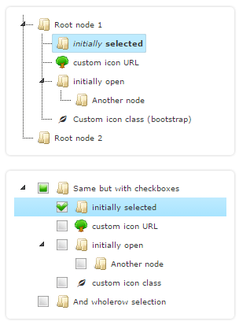

# yii2-jstree jsTree is jquery plugin for Yii2

[](https://packagist.org/packages/rootlocal/yii2-jstree)

* [Source code](https://github.com/rootlocal/yii2-jstree)



## Install

```
composer require rootlocal/yii2-jstree
```

or add

~~~json
"rootlocal/yii2-jstree" : "dev-master",
~~~

to the require section of your composer.json.

### View

~~~php
<?php
use rootlocal\widgets\jstree\JsTreeWidget;
use yii\helpers\Url;
use yii\web\View;

/**
 * @var View $this
 */
?>

<?= JstreeWidget::widget([
    'theme' => JsTreeWidget::THEME_BOOTSTRAP3,
    'url' => Url::to(['tree/explorer-request']),
    'plugins' => ['dnd'],

    'actions' => [

        'rename' => [
            'url' => Url::to(['tree/rename-node']),
            'label' => 'Rename',
            'icon' => 'glyphicon glyphicon-pencil',
        ],

        'remove' => [
            'url' => Url::to(['tree/delete-node']),
            'label' =>  'Remove',
            'icon' => 'glyphicon glyphicon-remove',
        ],

        'select' => [
            'url' => Url::to('menu/update'),
        ],

        'move' => [
            'url' => Url::to(['tree/move-node']),
        ]

    ],

    'types' => [
        'child' => ['icon' => 'glyphicon glyphicon-leaf'],
        'root' => ['icon' => 'glyphicon glyphicon-folder-open'],
    ],

]) ?>
~~~

### TreeController

~~~php
use yii\web\Controller;

class TreeController extends Controller {
// ...

    /**
    * Request tree
    * @param string|int $id
    * @return array
    */
    public function actionExplorerRequest($id = '#'): array
    {
        if (Yii::$app->request->isPjax || Yii::$app->request->isAjax) {
            Yii::$app->response->format = Response::FORMAT_JSON;
        }

        $data = [];

        if ($id === '#') {
            $children = Menu::find()->roots()->orderBy(['id' => SORT_ASC])->all();


            foreach ($children as $child) {
                $childrenCount = $child->getChildren()->count();

                $data[] = [
                    'id' => $child->id,
                    'text' => $child->name,
                    'children' => $childrenCount > 0,
                    //'icon' => 'glyphicon glyphicon-folder-close',
                    'type' => $childrenCount > 0 ? '' : 'child',
                ];
            }

            return $data;
        }

        $root = Menu::findOne($id);
        $data['id'] = $id;
        $data['text'] = $root->name;
        $data['children'] = [];

        $children = $root->getChildren()->all();

        foreach ($children as $child) {
            $childrenCount = Menu::findOne($child['id'])->getChildren()->count();

            $data['children'][] = [
                'id' => $child->id,
                'text' => $child->name,
                'children' => $childrenCount > 0,
                //'icon' => 'glyphicon glyphicon-folder-close',
                'type' => $childrenCount > 0 ? '' : 'child',
            ];
        }

        return $data;
    }
}
~~~